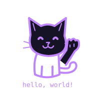

<h1 align="center">Hi 👋🏽, I'm Natalie</h1>

  

  Computer Science student
   
  Turning ideas into projects, one line of code at a time.

---

### 🌸 About me

- 🎓 Studying Computer Science
- 💻 Learning web development, algorithms, and C++
- 🏡 Interested in real estate
- 🎮 Curious about game development
- 🌱 Using this space to share my learning experience

### 💻 Languages I'm learning and using

  

### 🛠️ Tools

  
    
  

---

  

